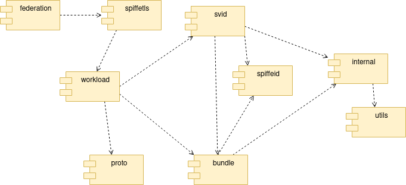

<!--
(C) Copyright 2020-2021 Hewlett Packard Enterprise Development LP

 

Licensed under the Apache License, Version 2.0 (the "License"); you may
not use this file except in compliance with the License. You may obtain
a copy of the License at

 

    http://www.apache.org/licenses/LICENSE-2.0

 

Unless required by applicable law or agreed to in writing, software
distributed under the License is distributed on an "AS IS" BASIS, WITHOUT
WARRANTIES OR CONDITIONS OF ANY KIND, either express or implied. See the
License for the specific language governing permissions and limitations
under the License.

-->

# Modules

The project structure is organized into modules:

- [**bundle**](bundle/README.md)  facilities for manipulating bundles.
- [**federation**](federation/README.md)  facilities for retrieving and serving federated bundles.
- [**internal**](internal/README.md)  general use utility functions.
- [**logger**](logger/README.md)  code for logging functions.
- [**protos**](protos/README.md)  ProtoBuf definition for the SPIFFE Workload API. C++ GRPC code is generated from this.
- [**spiffeid**](spiffeid/README.md)  facilities for manipulating spiffe IDs and Trust Domains.
- [**spiffetls**](spiffetls/README.md)  Functions for using TLS with SPIFFE.
- [**svid**](svid/README.md)  utility functions for SVIDs.
- [**utils**](utils/README.md)  general use utility functions.
- [**workload**](workload/README.md) facilites for fetching SVIDs and Bundles from the Workload API.

## Dependency Diagram

