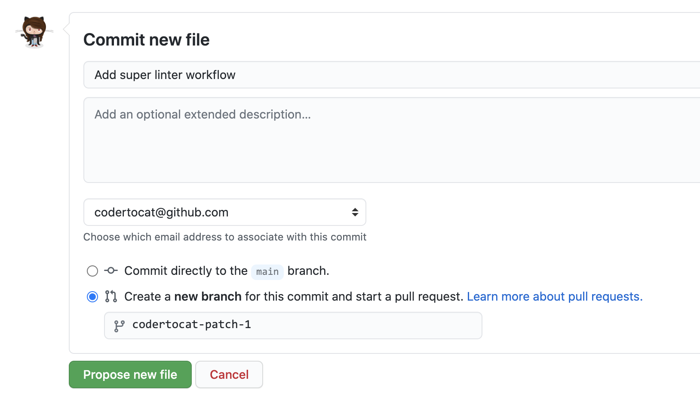
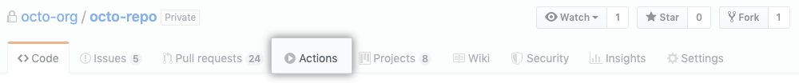
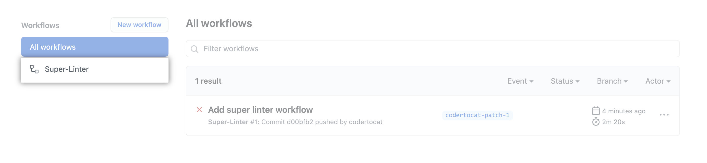

# c-spiffe

C extension for Spiffe platform.

[](https://github.com/HewlettPackard/c-spiffe/actions/workflows/actions.yml)

[](https://codecov.io/gh/HewlettPackard/c-spiffe)

## Introduction

<!--TODO: Rewrite introduction -->

## Project structure


## Dependencies

* gRPC 1.34
* CMake 3.13.0+

##  Build Docker Image

```
docker build -f docker/grpc.Dockerfile --build-arg GPRC_VERSION=1.34.0 --build-arg NUM_JOBS=8 --tag grpc-build:1.34.0 .
```

## Run Docker Container

#### setting volume path: <code>/mnt</code>

```
docker run -it --rm --network host -v $(pwd):/mnt grpc-build:1.34.0
```

# For Windows 

```
docker run -it --rm --network host -v //c/Repositorios/c-spiffe:/mnt grpc-build:1.34.0
```

## Building
Build the c-spiffe project:
```
cd /mnt
mkdir build && cd build
cmake ..
make
make test
```
After running `make test`, you will find the test files into `Testing` folder.

### Code Coverage Support

This implements Code Coverage Reports using either using either `gcov` or `lcov`.
If you want to check them, you should run the following command after `make test`:

```
make gcov
make lcov
```

The coverage reports will be into `Coverage` folder. In the case of `lcov`, you
can see into the browser, opening the `index.html` file on the folder above.

# Continuous Integration (CI)

## Operation

Continuous integration (CI) is a practice where a team of developers integrate their code early and often to the main branch or code repository. The goal is to reduce the risk of seeing “integration hell” by waiting for the end of a project or a sprint to merge the work of all developers.

To adopt continuous integration, we will need to run your tests on every change that gets pushed back to the main branch. To do so, you will need to have a service that can monitor your repository and listen to new pushes to the codebase. 


# Introduction

We only need an existing GitHub repository to create and run a GitHub Actions workflow. In this guide, you'll add a workflow that lints multiple coding languages using the GitHub Super-Linter action. The workflow uses Super-Linter to validate your source code every time a new commit is pushed to your repository.

# To use Github Actions CI/CD, we need:

Most CI tools integrate seamlessly with Git services — especially GitHub.

<ol>
    <li>
    From your repository on GitHub, create a new file in the .github/workflows directory named superlinter.yml.
    </li>
    <li>
    Copy the following YAML contents into the superlinter.yml file. Note: If your default branch is not main, update the value of DEFAULT_BRANCH to match your repository's default branch name.

```
name: Super-Linter

# Run this workflow every time a new commit pushed to your repository
on: push

jobs:
  # Set the job key. The key is displayed as the job name
  # when a job name is not provided
  super-lint:
    # Name the Job
    name: Lint code base
    # Set the type of machine to run on
    runs-on: ubuntu-latest

    steps:
      # Checks out a copy of your repository on the ubuntu-latest machine
      - name: Checkout code
        uses: actions/checkout@v2

      # Runs the Super-Linter action
      - name: Run Super-Linter
        uses: github/super-linter@v3
        env:
          DEFAULT_BRANCH: main
          GITHUB_TOKEN: ${{ secrets.GITHUB_TOKEN }}
```
</li>
    <li>
    To run your workflow, scroll to the bottom of the page and select Create a new branch for this commit and start a pull request. Then, to create a pull request, click Propose new file.
    </li>
 </ol>

 

Committing the workflow file in your repository triggers the push event and runs your workflow.

# Viewing your workflow results

<ol>
    <li>
    On GitHub, navigate to the main page of the repository.
    </li>
    <li>
    Under your repository name, click <b>Actions</b>.


    </li>
    <li>
    In the left sidebar, click the workflow you want to see.


    </li>
    <li>
    From the list of workflow runs, click the name of the run you want to see.


    </li>
    <li>
    Under <b>Jobs</b> or in the visualization graph, <b>click the Lint code base</b> job.


    </li>
    <li>
    Any failed steps are automatically expanded to display the results.


    </li>
</ol>
