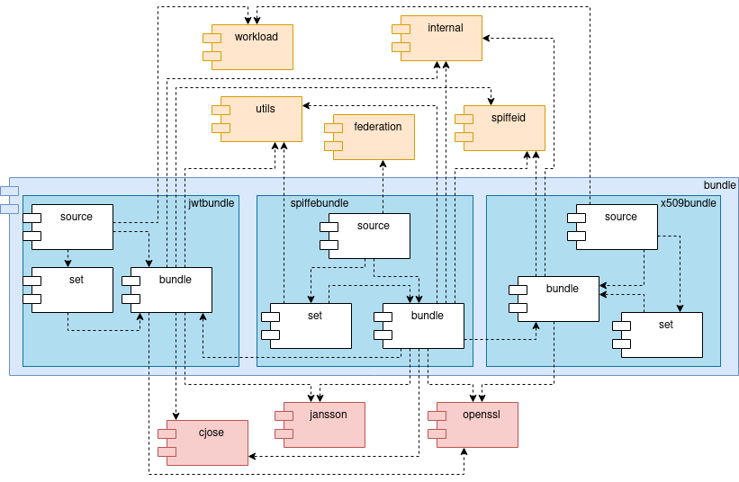

<!--
(C) Copyright 2020-2021 Hewlett Packard Enterprise Development LP

 

Licensed under the Apache License, Version 2.0 (the "License"); you may
not use this file except in compliance with the License. You may obtain
a copy of the License at

 

    http://www.apache.org/licenses/LICENSE-2.0

 

Unless required by applicable law or agreed to in writing, software
distributed under the License is distributed on an "AS IS" BASIS, WITHOUT
WARRANTIES OR CONDITIONS OF ANY KIND, either express or implied. See the
License for the specific language governing permissions and limitations
under the License.

-->

# Bundle

The Bundle module is composed by utility functions for bundles, such as creation, deletion and validation. Most used internally by other modules. It contains three sub modules:

* **jwtbundle** Contains utility functions for bundles using the JWT specification.
* **x509bundle** Contains utility functions for bundles using the X509 specification.
* **spiffebundle** Not implemented yet. It will contain convenience functions for both modules.

