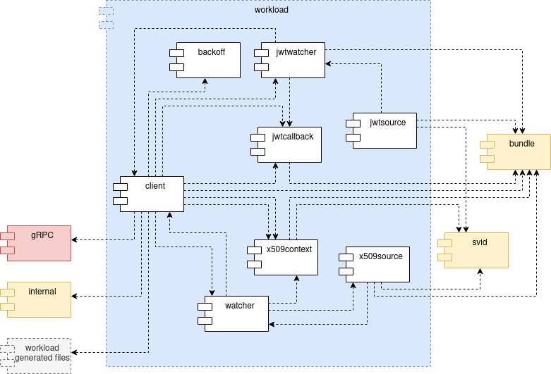

<!--
(C) Copyright 2020-2021 Hewlett Packard Enterprise Development LP

 

Licensed under the Apache License, Version 2.0 (the "License"); you may
not use this file except in compliance with the License. You may obtain
a copy of the License at

 

    http://www.apache.org/licenses/LICENSE-2.0

 

Unless required by applicable law or agreed to in writing, software
distributed under the License is distributed on an "AS IS" BASIS, WITHOUT
WARRANTIES OR CONDITIONS OF ANY KIND, either express or implied. See the
License for the specific language governing permissions and limitations
under the License.

-->

# Workload

The Workload module is composed by Workload API functions and is intended to be used by the final user. It was mostly based on the [go-spiffe](https://github.com/spiffe/go-spiffe) Workload API implementation. All the supported functions are implemented. Refer to the test folder for some examples.

